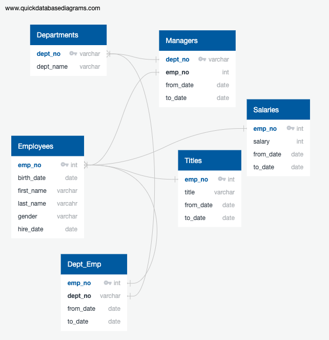

# Pewlett-Hackard-Analysis

## Reason for analysis

The purpose for this analysis was to determine the number of employees who are
nearing retirement age. This will allow us to make preparations to fill these
positions in the future and have a plan in place when the time comes. We also wanted to

## Methods
Outline steps taken to solve problem as well as any issue encountered

For Deliverable 1 we first created a table of employees (emp_info, which was previously created in a previous exercise) eligible for retirement in the upcoming years. We selected them by first selecting employees born between January 1st, 1952 and December 31st, 1955 and that were still working in the company. I then combined that table with the titles tables to get the titles and the from_date and to_date and the salaries table to get the salary. Two inner joins were utilized as well as order by and partition, since there were many employees with multiple titles during their tenure with the company. There were a total of 33,118 employees eligible.

We then used group by on title as well as count to ascertain the total of people retiring by title. To get the number of titles represented in this group, I used a distint count on title to determine there were 7 titles represented in this group.

For Deliverable 2 we ran two inner joins to combine the employees, dept_emp, and titles tables using 2 inner joins to get the list of employees eligible for the mentorship program. The conditions for this were employees born in 1965 and that were current employees. We had to set a condition where the dept_emp.to_date and titles.to_date both equaled to '9999-01-01' to get a list without duplicates.

## Results

The titles count can be found on the following file in the repository: Data/count_titles.csv

The table showing the number of employees set for retirement by title is found on the following file in the repository: Data/emp_count_by_title.csv

The complete list of employees along with title and salary can be found on the following file on the repository: Data/retirement_emp_title_list.csv

### Figures

ERD for tables

This diagram shows the tables where the data was originally loaded into and the relationships.

### Limitations and future considerations

For Deliverable 2 I found that there was a more efficient way to obtain this table by using only 1 inner join between employees and table on emp_no, and setting a condition for the birth_date to be between Jan 1st and Dec 31st in 1965 and have the to_date equal to '9999-01-01'. This yields the same resulting set.
